# Tugas Praktikum { Pertemuan ke 4 } 


|**Nama**|**NIM**|**Kelas**|**Matkul**|
|----|---|-----|------|
|Muhammad Ikhsan Fakhrudin|312210019|TI.22.A2|Basis Data|

# Soal Latihan Praktikum

## Data Model Mapping

```
Mahasiswa (nim, nama, jenis_kelamin, tgl_lahir, jalan, kota, kodepos, no_hp, kd_ds)

Dosen (kd_ds, nama)

Matakuliah (kd_mk, nama, sks)

JadwalMengajar (kd_ds, kd_mk, hari, jam, ruang)

KRSMahasiswa (nim, kd_mk, kd_ds, semester, nilai)
```
- Buat DDL Script berdasarkan skema ERD tersebut diatas. 
- Jalankan script DDL tersebut pada DBMS MySQL.

**langkah-langkahnya :**

**1. buat dulu script untuk table mahasiswa :**

```
CREATE TABLE Mahasiswa 
(nim VARCHAR(10) PRIMARY KEY, nama VARCHAR(255) NOT NULL, jenis_kelamin ENUM('Laki-Laki', 'Perempuan'), 
tgl_lahir DATE,jalan VARCHAR(255) NOT NULL, kota VARCHAR(255) NOT NULL, 
kodepos VARCHAR(5) NOT NULL, 
no_hp VARCHAR(15) NOT NULL, 
kd_ds VARCHAR(10) NOT NULL, FOREIGN KEY (kd_ds) REFERENCES Dosen(kd_ds))
```

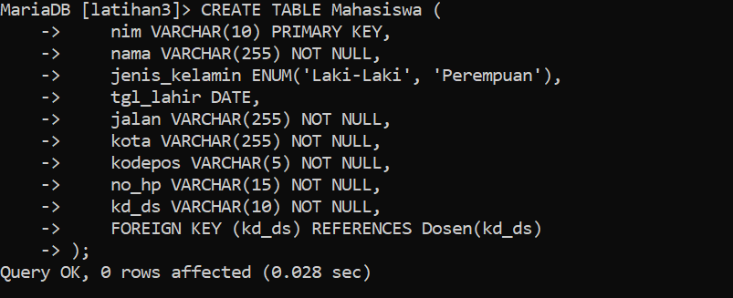


**tampilkan hasil table :**

`desc mahasiswa;`

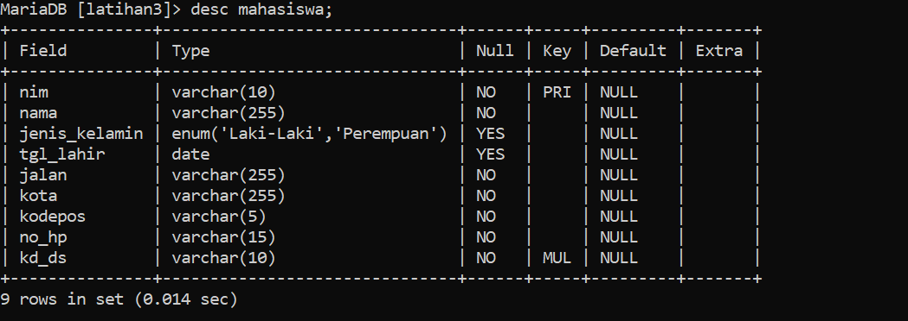

**2. buat script untuk table dosen :**
```
CREATE TABLE Dosen 
( -> kd_ds VARCHAR(10) PRIMARY KEY, ->  
   nama VARCHAR(255) NOT NULL -> );
```

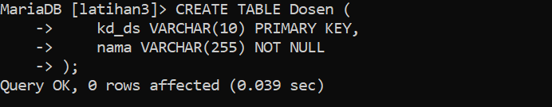

**tampiilkan tabel :**

`desc dosen;`

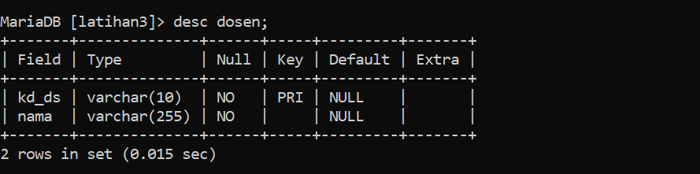

**3. buat script untuk mata kuliah :**
```
CREATE TABLE Matakuliah 
( -> kd_mk VARCHAR(10) PRIMARY KEY, ->
     nama VARCHAR(255) NOT NULL, -> 
     sks INT NOT NULL -> );
```

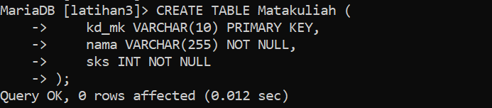

**tampilkan table :**

`desc Matakuliah;`

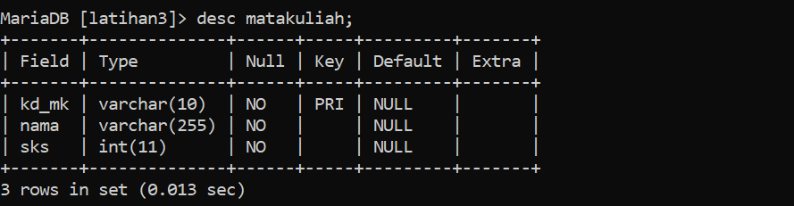

**4. Buat script untuk jadwal mengajar :**
```
CREATE TABLE JadwalMengajar 
( ->     kd_ds VARCHAR(10) NOT NULL, ->     kd_mk VARCHAR(10) NOT NULL, ->     hari ENUM('Senin', 'Selasa', 'Rabu', 'Kamis', 'Jumat', 'Sabtu', 'Minggu') NOT NULL, ->     jam TIME NOT NULL, ->     ruang VARCHAR(255) NOT NULL, ->     PRIMARY KEY (kd_ds, kd_mk, hari, jam), ->     FOREIGN KEY (kd_ds) REFERENCES Dosen(kd_ds), ->     FOREIGN KEY (kd_mk) REFERENCES Matakuliah(kd_mk) -> ); 
```

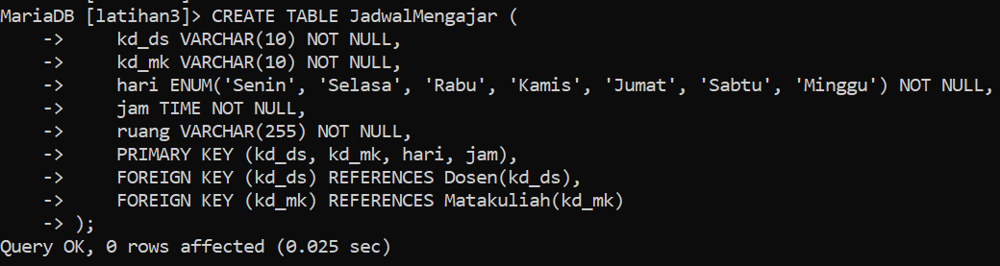

**tampilkan table :**

`desc JadwalMengajar;`

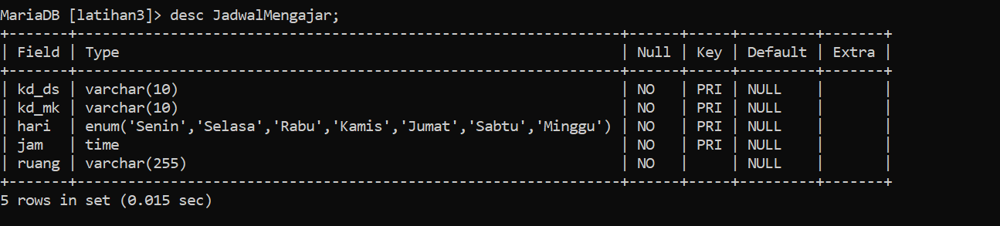

**5. Buat script untuk KRSMahasiswa :**
```
CREATE TABLE KRSMahasiswa 
( ->     nim VARCHAR(10) NOT NULL, ->     kd_mk VARCHAR(10) NOT NULL, ->     kd_ds VARCHAR(10) NOT NULL, ->     semester VARCHAR(10) NOT NULL, ->     nilai FLOAT NOT NULL, ->     PRIMARY KEY (nim, kd_mk), ->     FOREIGN KEY (nim) REFERENCES Mahasiswa(nim), ->     FOREIGN KEY (kd_mk) REFERENCES Matakuliah(kd_mk), ->     FOREIGN KEY (kd_ds) REFERENCES Dosen(kd_ds) -> );
```

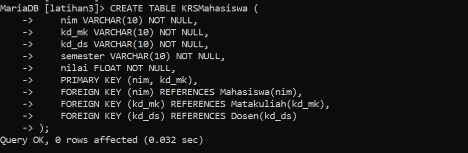

**tampilkan table :**

`desc KRSMahasiswa;`

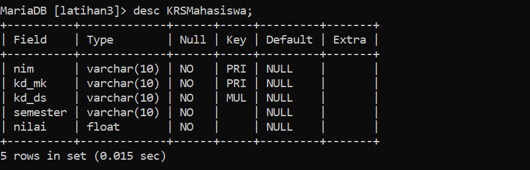

**Berikut script secara keseluruhan :**

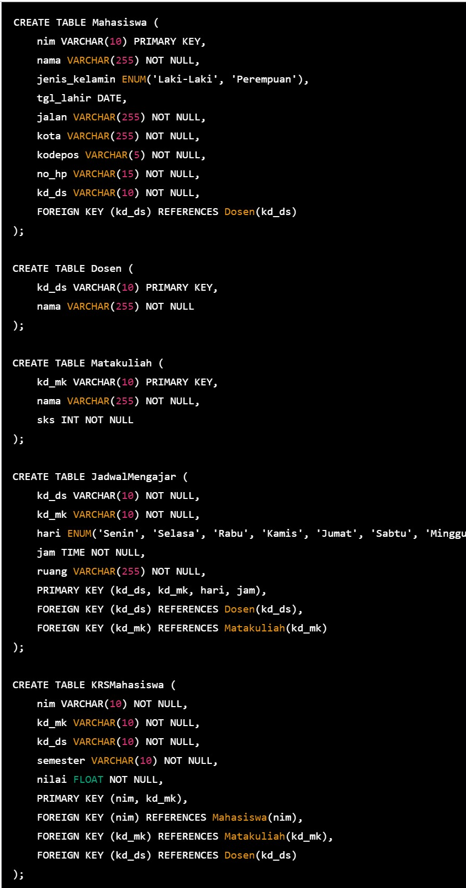

## FINISH...